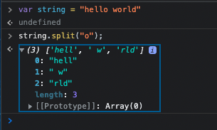

# wills-weather-dashboard
Weather App that shows the current weather and 5-day forecast for a given city

## OVERVIEW
A simple dashboard using the OpenWeather One Call API that gives users the weather once they enter in a City name. 

## Link to Live Application
https://wyork63.github.io/wills-weather-dashboard/

## Link to Repo
https://github.com/wyork63/wills-weather-dashboard

## Picture of Deployed application
